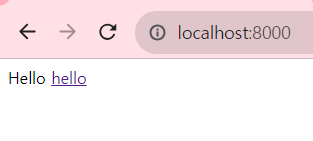
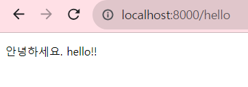
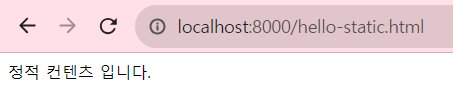
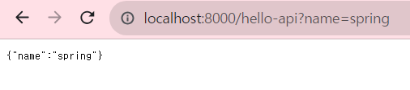
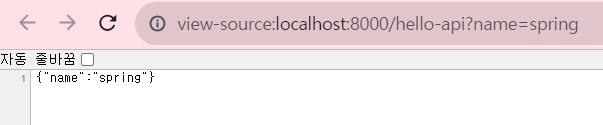
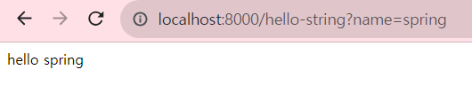
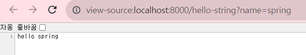

# Spring


## 스프링 시작  

스프링 정상 구동을 확인한 후, 에러페이지가 아닌 기본 시작 페이지를 설정하였습니다.

스프링이 기본 제공하는 Welcome Page로 resources 아래의 index.html 파일이 존재한다면 이 페이지를 시작 페이지로 설정할 수 있습니다.


`src/resources/index.html` 위치에 index 페이지를 생성한 후, 기본 html 코드를 작성하면
localhost:8000 접속 시 index 페이지가 보여집니다.



---

Spring이 제공하는 템플릿 엔진에는 여러 종류가 있는데, 이 중 Thymeleaf를 사용했습니다.

- FreeMarket
- Groovy
- Thymeleaf
- Mustache

Thymeleaf 는 `resources/templates` 아래 경로에 생성하여 이용할 수 있습니다.
`hello.html` 파일에 themeleaf 문법을 이용해 코드를 작성했습니다.

```html
> </p> th:text="'안녕하세요. ' + ${data}" >안녕하세요. 손님</p> 
```

${data} 로 data 변수를 받아올 수 있게 작성하고

`java/hello.hellospring.controller` controller 패키지 생성 후
`HelloController.java` 파일을 생성합니다.

```java
@GetMapping("hello")
public String hello(Model model) {
    model.addAttribute("data", "hello!!");
    return "hello";
```

컨트롤러를 통해 주소가 "hello"에 매핑되면 model에 값을 전달후 반환하여 data의 값을 넘겨
hello.html에 전달한 후 반환합니다.



---

IntelliJ 내부에서 웹서버 정상 구동은 확인했으니, cmd에서 빌드를 진행했습니다.

우선 `application.properties`에
```
server.port = 8000
```
를 추가하여 8080이 아닌 8000으로 동일하게 설정했고


cmd에서 프로젝트 경로에 위치한 후, 

1. .\gradlew.bat build (**오류 시** gradlew clean build)
2. cd build/libs
3. java -jar .\hello-spring-0.0.1-SNAPSHOT.jar

다음 과정을 통해 빌드를 성공적으로 마쳤습니다. 아래 방법으로 서버를 종료시킬 수 있습니다.

1. netstat -a -o
2. 8000 포트의 PID 확인
3. 관리자 권한으로 cmd 실행
4. taskkill -f -pid **[PID번호]**

---

## 웹 개발 기초
### 정적 컨텐츠

스프링은 기본적으로 컨트롤러가 우선순위를 가지므로, 컨트롤러가 없다면 static 아래의 html이 그 다음으로 실행됩니다.

`hello-static.html`
```html
<body>
    정적 컨텐츠 입니다.
</body>
```




---

### MVC와 템플릿 엔진
MVC : Model, View, Controller

Controller에 hello-mvc 주소가 매핑되면 name 키에 파라미터로 넘긴 값을 전달하고
` hello-template.html` 로 변환한다.

이때, URL에 **hello-mvc?name=value** 를 통해 GET 방식으로 파라미터 값을 전달해줘야 한다.
```java
@GetMapping("hello-mvc")
public String helloMvc(@RequestParam("name") String name, Model model) {
    model.addAttribute("name", name);
    return "hello-template";
}
```

---

### API

API는 @**ResponseBody** 를 사용하는데, 
이는 **viewResolver**를 통해 HTML로 변환하는 MVC나 정적 컨텐츠와 다르게 
**HttpMessageConverter** 가 동작되고, 객체는 HTML이 아닌 json 형태로, 문자는 String 형태로 나타납니다.


```java
@GetMapping("hello-api")
@ResponseBody
public Hello helloApi(@RequestParam("name") String name) {
    Hello hello = new Hello();
    hello.setName(name);
    return hello;
}
static class Hello {
    private String name;
    
    public String getName() {
        return name;
    }
    
    public void setName(String name) {
        this.name = name;
    }
}
```





