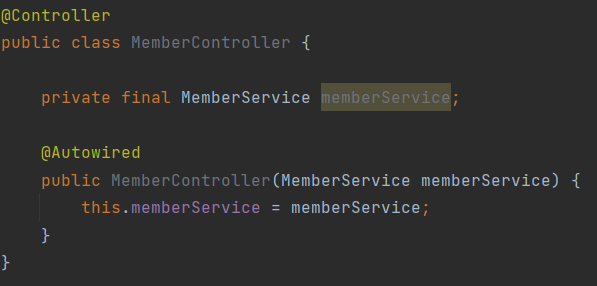
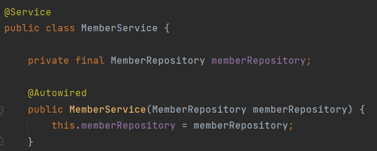
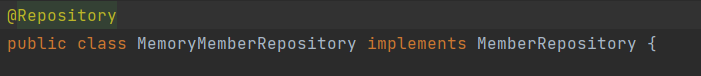
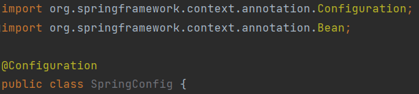
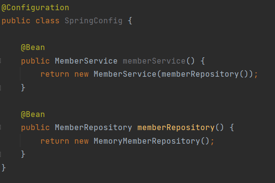

# Spring

## Test Case

### 테스트 코드 생성
1. `src/test/java` 아래에 테스트 java 파일을 생성하여 JUnit 프레임워크를 통해 테스트를 진행합니다.

2. `Alt` + `Enter` 후 `Create Test` 를 선택하여 테스트를 진행할 메소드를 선택하면
테스트 패키지에 자동으로 테스트 클래스가 생성됩니다.


### 어노테이션

테스트 코드는 JUnit 프레임워크를 이용해 실행됩니다.

assertThat()을 통해 기대값과 결과값을 비교하여 테스트가 진행됩니다.


**@Test**
> 실행할 메소드 위에 어노테이션을 작성해 해당 메소드가 단위 테스트임을 명시한다.

**@AfterEach**
> 각 테스트가 종료 될 때마다 해당 내용을 실행한다.  
> 테스트 종료 후 DB에 남은 테스트 결과를 지우기 위해 사용된다.

**@BeforeEach**
> 각 테스트 실행 전에 호출된다. 테스트가 서로에게 영향을 주지 않도록 항상 새로운 객체를 생성한다.


### 테스트 코드 작성

테스트 코드를 작성할 때엔 

Given , When, Then 패턴을 이용해 준비-실행-검증 단계를 거친다.

**Given** : 어떠한 **상황이** 주어졌을 때  
**When** : 어떠한 메소드를 **실행하면**  
**Then** : 어떠한 **결과가** 나와야 한다.  


준비 단계에선 변수, 입력값 등 테스트에 이용되는 값들을 준비한다.  

실행 단계에선 실제로 메소드를 수행하여 테스트를 실행한다.  

검증 단계에선 예상한 값(기댓값)과 실제 결과 값을 검증하여 두 값이 일치하는지 확인한다.  
주로 `assertThat().isEqualTo() ` 메소드를 통해 값을 검증한다. 


```java

@Test
public void findAll() {
        //given
        Member member1 = new Member();
        member1.setName("spring1");
        repository.save(member1);
        Member member2 = new Member();
        member2.setName("spring2");
        repository.save(member2);
        ㅌㅌ
        //when
        List<Member> result = repository.findAll();
        
        //then
        assertThat(result.size()).isEqualTo(2);
}

```

## Spring Been

스프링 빈으로 등록하는 방법에는 두 가지가 있다.

### 컴포넌트 스캔
첫번째는 컴포넌트 스캔을 이용하여 자동 의존관계를 설정하는 방법으로,
각 Controller, Service, Repository 에 어노태이션을 이용하여 의존관계를 추가한다. 


생성자에 @AutoWired 를 추가해서 컴포넌트 스캔을 통해 자동으로 스프링 빈으로 등록되게 한다.
생성자에 추가하는 생성자 주입 외에도 필드주입, Setter 주입 방식도 존재한다. 

1. Controller 클래스 위에 @Controller 를 추가하고 생성자에 @AutoWired 추가




2. Service 클래스 위에 @Service 를 추가하고 생성자에 @AutoWired 추가
  

3. Repository 클래스 위에 @Repository
  

다음과 같이 의존관계를 추가하면 Service 와 Repository 가 스프링 컨테이너에 스프링 빈으로 등록된다.
이떄, 같은 스프링 빈이면 모두 같은 인스턴스인 **싱글톤**으로 등록한다.


### 자바 코드로 직접 등록

두번째 방법은, 자바 코드를 작성하여 직접 스프링 빈을 등록하는 방식이다.

이 방식은 정형화 되지 않거나, 구현 클래스를 변경해야 할 때에 보다 편리하게 변경할 수 있다.

1. Controller 클래스 위에 @Controller 를 추가하고 생성자에 @AutoWired 추가


2. Bean 정보를 작성할 Config 클래스 파일 생성후 @Configuration 어노테이션 추가



3. @Bean 어노테이션을 추가하여 스프링 빈 등록


