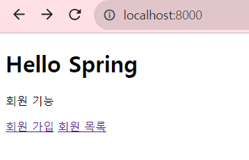
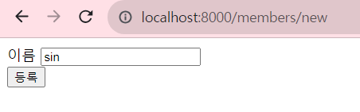
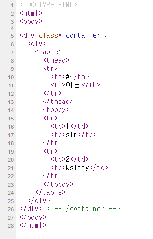
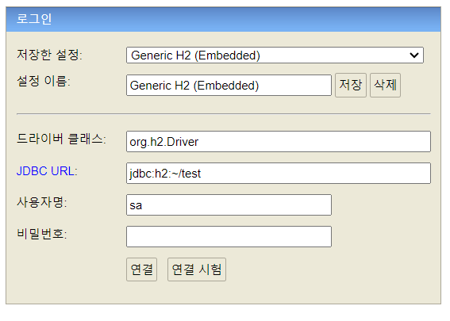
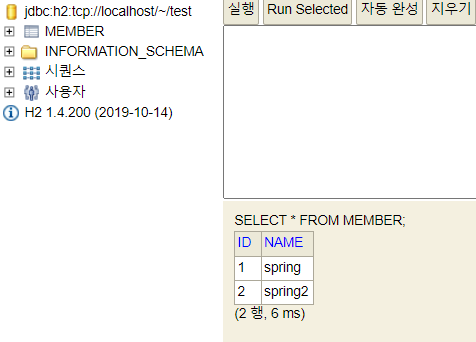

# Spring

## 웹 MVC 개발

새로운 HomeController 클래스를 생성하고 `/` URL와 home.html 을 맵핑하여
localhost:8000 접속 시에 index 페이지가 아닌, home 페이지가 로딩되도록 설정한다.

이때, 기본으로 로딩되는 index 페이지와 `/` 에 맵핑시킨 home.html 페이지의 접속 경로는 동일하지만,   
정적 컨텐츠 보다 컨트롤러를 통한 페이지의 우선순위가 높기 때문에 index 페이지가 아닌 home 페이지가 로딩된다.


회원가입을 진행할 `createMemberForm.html` 과 회원목록을 조회할 `memberList.html` 를 생성하고,  
Controller 를 통해 각 주소와 맵핑한다. 이때, 회원가입을 진행할 Form 은 Post 방식으로 데이터를 주고 받기 때문에  
**@PostMapping** 을 통해 데이터를 받을 수 있게 해야한다.

```java
@GetMapping("/members/new")
public String createForm() {
        return "members/createMemberForm";
        }

@PostMapping("/members/new")
public String create(MemberForm form) {
        Member member = new Member();
        member.setName(form.getName());

        memberService.join(member);

        return "redirect:/";
        }
```


`<home.html>`



`<createMemberForm.html>`



---

회원 목록을 조회하는 memberList.html에서는 thymeLeaf 문법을 사용하여 회원 목록을 불러온다.

```html
<!DOCTYPE HTML>
<html xmlns:th="http://www.thymeleaf.org">
<body>

<div class="container">
  <div>
    <table>
      <thead>
      <tr>
        <th>#</th>
        <th>이름</th>
      </tr>
      </thead>
      <tbody>
      <tr th:each="member : ${members}">
        <td th:text="${member.id}"></td>
        <td th:text="${member.name}"></td>
      </tr>
      </tbody>
    </table>
  </div>
</div> <!-- /container -->
</body>
</html>
```

`<memberList.html>`




---


## DB

h2 데이터베이스를 다운로드 후 설치한다.

설치 후 cmd를 통해 해당 H2/bin 디렉토리에 접근한 후 h2.bat 명령어를 입력한다.(윈도우)


다음과 같은 suggestion 문장을 따라 .\h2.bat 명령어를 통해 실행했다.




---

`C:\User\사용자명` 위치에 test.mv.db 파일과 .h2.server.properties 생성을 확인한 후,  
JDBC URL 을 jdbc:h2:tcp://localhost/~/test 로 변경하여 접속한다.

이후 다음과 같이 테이블을 생성한다.



추가적으로, 프로젝트 루트 폴더 아래에 `sql/ddl.sql` 파일을 생성해 테이블을 관리한다.

----
