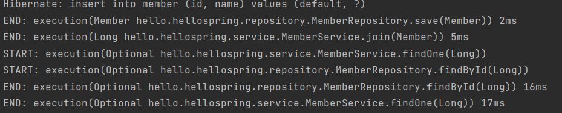

# Spring

##AOP
AOP : Aspect Oriented Programming

공통관심사항과 핵심관심사항을 구분하기 위해 이용

### AOP 이용X
모든 메소드의 호출 시간 측정을 원할 때, 각 메소드에 모두 시간 측정 코드를 작성하여 메소드를 수정해야한다.

```java
public Long join(Member member) {
    long start = System.currentTimeMillis();
    try {
        validateDuplicateMember(member); //중복 회원 검증
        memberRepository.save(member);
        return member.getId();
    } finally {
        long finish = System.currentTimeMillis();
        long timeMs = finish - start;
        System.out.println("join " + timeMs + "ms");
    }
 }

public List<Member> findMembers() {
    long start = System.currentTimeMillis();
    try {
        return memberRepository.findAll();
    } finally {
        long finish = System.currentTimeMillis();
        long timeMs = finish - start;
        System.out.println("findMembers " + timeMs + "ms");
    }
}
```

다음과 같이 로직을 추가하면,

핵심관심사항이 아닌 공통관심사항의 로직이 섞여서 유지보수가 어렵고  
만약 이 로직을 변경해야 한다면 모든 메소드의 로직을 직접 변경해야한다.

---

### AOP 이용

`TimeTraceAop` 클래스 생성

```java
@Component
@Aspect
public class TimeTraceAop { 
    @Around("execution(* hello.hellospring..*(..))") 
    public Object execute(ProceedingJoinPoint joinPoint) throws Throwable {
        long start = System.currentTimeMillis();
        System.out.println("START: " + joinPoint.toString());
        try {
            return joinPoint.proceed();
        } finally {
            long finish = System.currentTimeMillis();
            long timeMs = finish - start;
            System.out.println("END: " + joinPoint.toString()+ " " + timeMs + "ms");
        }
    }
}
```

시간 측정 로직을 공통 로직으로 제작

회원가입, 회원 조회 등 핵심 관심사항과 시간 측정 공통관심사항을 분리하여 유지보수가 편리하며  
변경이 필요하면 해당 로직만 변경하면 되고, 적용 대상 선택도 가능하다.

---

### 의존관계

Controller → Service 의 의존관계에서  
Controller → 프록시 Service → 실제 Service 로 의존관계가 변경된다.


전체에 AOP를 적용하면
프록시 Controller → Controller → 프록시 Service → Service → 프록시 Repository → Repository

프록시에서 실제로 넘어갈 때엔 joinPont.proceed ()가 이용된다.

