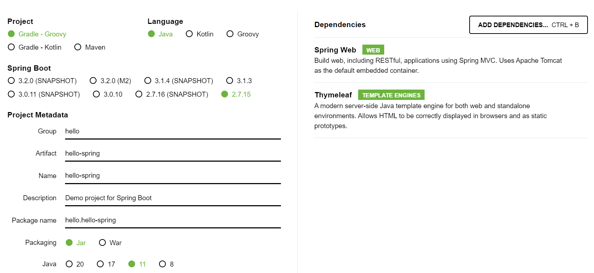

# Spring

## 스프링 시작  

스프링 시작에 앞서 JDK 16 → 11로 변경한 후,

> https://start.spring.io/
  

다음 사이트를 통해 Spring boot를 시작했습니다.

---

다음과 같이 설정 후 Spring을 정상적으로 설치하여 프로젝트에서 실행하였는데,

첫번째로 발생한 오류는  
> Process 'command 'C:/Program Files/Java/jdk-11.0.16.1/bin/java.exe'' finished with non-zero exit value 1  

로 IntelliJ의 Gradle Project 설정값을 변경하여 해결했습니다.

https://blog.naver.com/seul__189/223173922678

---

 

두번째로는 8080 포트가 중복 사용 되어 오류가 발생하여,  
IntelliJ의 환경 변수에서 포트를 8000으로 지정해 해결했습니다.

https://choicode.tistory.com/30

정상 실행 완료
