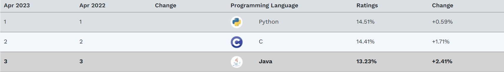
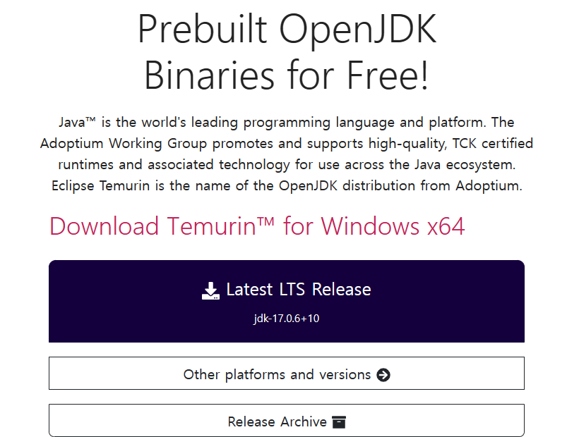
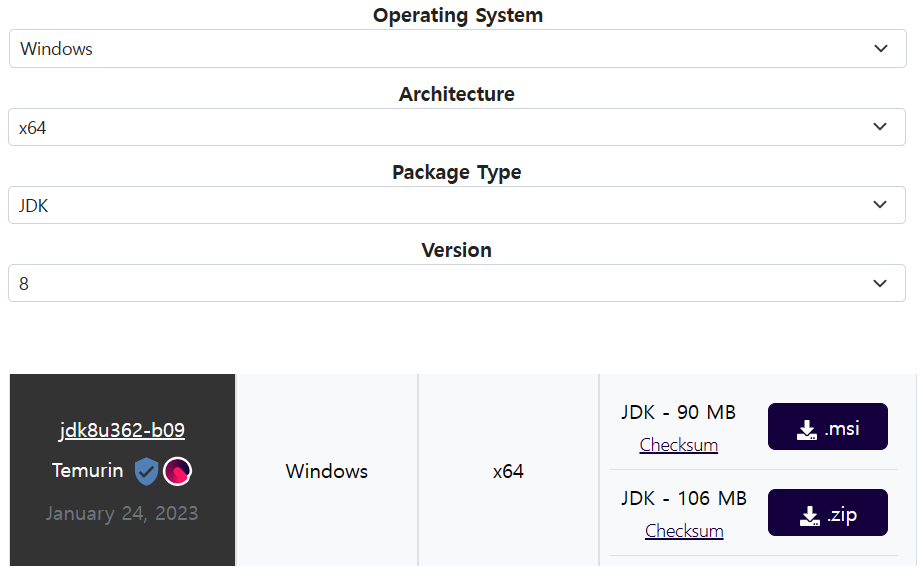
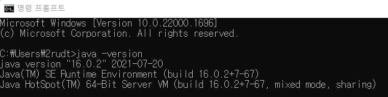
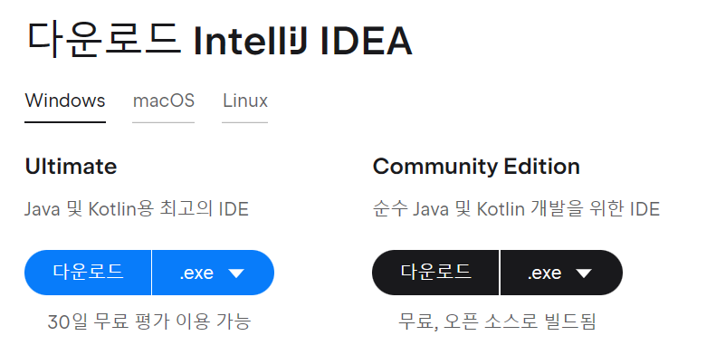

# JAVA 시작하기

### JAVA란?
간단히 프로그래밍 언어 중 하나로,

프로그래밍 언어별 인기 순위를 발표하는 사이트 [TIOBE Index](https://www.tiobe.com/tiobe-index/) 
에서 현재 3위를 꾸준히 유지하고 있는 점유율이 매우 높은 언어입니다.

 > 2023-04-13 기준

## JAVA 언어의 특징

JAVA 언어의 특징 몇가지만 간단히 알아보겠습니다. 

### ① 객체 지향 언어
: 프로그램의 부품 역할을 하는 객체를 만들고, 객체들을 조립 및 연결하여 전체 프로그램을 완성하는 프로그램 개발 기법입니다.

: 캡슐화, 상속, 다형성을 지원합니다.

### ② 플랫폼 독립성 WORA
: WORA(Write Once Run Anywhere)

한번 작성되어 컴파일 된 자바 코드는 모든 플랫폼에서 JVM만 있으면 바로 실행 가능합니다.

### ③ 인터프린터 언어
: .java 소스코드를 바이트코드로 컴파일해 .class 파일로 저장하고, JVM이 .class 파일의 바이트 코드를 인터프리트 하여 실행합니다.

이 밖에도 편리한 멀티스레드, 가비지 컬렉션 지원, 다양한 오픈소스 등 여러 특징이 있습니다.

##JDK 

JAVA를 본격적으로 이용하기에 앞서서 JDK를 컴퓨터에 설치해줘야 합니다.

먼저 JDK란(Java Development Kit), 자바 개발 도구(컴파일러 등) + JRE(JVM + 자바API)로 구성되어있는 통합적인 개발 도구입니다.

위에 언급된 JRE는, Java Runtime Environment로 자바 실행 환경을 뜻합니다.
JRE에는 JVM과 컴파일된 자바 API 클래스들이 들어있는 모듈 파일 등이 포함되어 있습니다.

즉 JDK는 자바 소프트웨어 개발환경으로 컴파일러, JVM, 자바 API 등이 포함되어 있는 자바 개발에 필요한 통합 도구입니다.

### JDK 다운로드

JDK에는 Oracle JDK, Open JDK, Amazon JDK 등 다양한 종류가 있습니다.
이 중 Open JDK를 이용할 예정입니다. 
Open JDK를 설치할 수 있는 다양한 사이트 중 [adoptium](https://adoptium.net/)
를 이용하여 JDK를 설치해보겠습니다.

Latest LTS Release를 이용하여 가장 최신의 LTS버전을 다운받을 수 있지만,
현재 시장에서 가장 많이 사용되는 8, 11버전을 이용하기 위해 Other versions를 클릭합니다.

원하는 버전과 운영체제를 선택한 후 아래에서 .msi 파일을 다운받습니다. 

다운로드가 끝나면 파일을 실행해 JDK 설치를 완료합니다.
파일 경로는 C:\Program Files\Java 경로를 추천합니다.

설치가 되었는지 확인하기 위해 CMD에 
''' java -version ''' 명령어를 통해 java 설치를 확인합니다.

위 사진처럼 출력된다면 설치가 정상적으로 마무리 된 것입니다.

만약 사진처럼 나오지 않는다면 설치가 정상적으로 되지 않았거나 환경변수 설정이 되어있지 않았기 때문입니다.

### 환경변수 설정

① 윈도우 검색창에 "시스템 환경 변수 편집"

② [고급] -> [환경변수] 클릭

③ 시스템 변수에 다음과 같이 JAVA_HOME 설정 (자바 설치 경로 추가)

④ 시스템 변수의 Path 항목 -> [편집] -> [새로 만들기] -> %JAVA_HOME%￦bin￦ 입력

## IDE(통합 개발 환경) 설치
개발자가 프로그래밍을 간편하게 할 수 있도록 제공해주는 도구로 코드 편집기, 디버거, 컴파일러, 인터프리터 등을 포함합니다.
대부분의 개발자는 IDE를 이용하여 프로그래밍하는데, 언어별로 주로 사용되는 IDE가 매우 다양합니다.

JAVA에서 자주 사용되는 IDE에는 eclipse, intelliJ가 있는데 저는 이 중에서 intelliJ를 사용합니다.

① [IntelliJ](https://www.jetbrains.com/ko-kr/idea/download/#section=windows) 사이트 접속

② Community Version 다운로드

③ 설치 진행 후 재부팅

이렇게 JDK 설치와 IDE 설치까지 정리해보았습니다. 다음 게시글은 기초 IDE 사용 방법과 자료형, 변수에 대해 알아보겠습니다.

