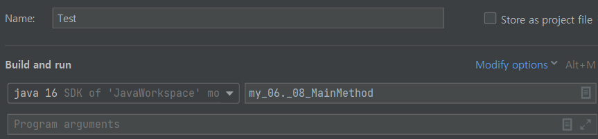

# 메인 메소드

자바 프로그램은 main() 메소드에서 가장 처음으로 실행 시작됩니다.  
public static void로 선언하고, String[] args로 실행 인자를 전달 받습니다.



java 프로그램에 실행 인자를 입력하고 메인 메소드를 실행할 수도 있습니다.  
위 이미지의 Program arguments에 인자를 입력하면 됩니다.

만약 실행 인자에 1 2 3 4 5 를 작성하면, 
이 프로그램이 실행 될 때 1, 2, 3, 4, 5 5개의 인자를 가진 채 프로그램을 실행하게 됩니다.

입력한 인자는 for-each문이나 for문으로 args 배열의 값을 받아와 확인할 수 있습니다.
```java
public static void main(String[] args) {
    for (String s : args) {
        System.out.println(S)
    }
}

/* 실행결과
1
2
3
4
5        
 */
```

실행 인자에 1, 2, 3 중 하나의 값을 입력하면, 입력한 값에 따라 명령문을 실행하는 예제입니다.

```java
switch (args[0]) {
    case "1" :
        System.out.println("실행 인자는 1입니다.");
        break;
    case "2" :
        System.out.println("실행 인자는 2입니다.");
        break;
    case "3" :
        System.out.println("실행 인자는 3입니다.");
        break;
    default:
        System.out.println("잘못 입력하셨습니다.");
}
```
