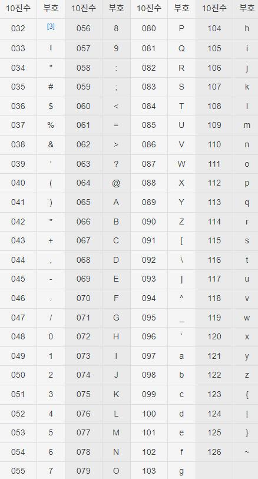

# 아스키 코드

아스키 코드란?
> 미국 ANSI 에서 만든 7비트 표준 코드로,
> 영문 키보드로 입력할 수 있는 모든 부호에 고유 코드가 할당되어 있습니다.



[출처 : 나무위키](https://namu.wiki/w/%EC%95%84%EC%8A%A4%ED%82%A4%20%EC%BD%94%EB%93%9C)

****

알파벳 대문자는 68, 소문자는 97, 숫자는 48부터 할당되어 있습니다.  
char형 알파벳을 int형으로 변환하면 아스키 코드 값으로 변환됩니다. 

```java
char c = 'A';
System.out.println(c);
System.out.println((int) c);

c++;
System.out.println(c);
System.out.println((int) c);

/* 출력 결과
A
65        
B
66
 */
```

## 아스키 코드로 배열 활용

배열에 알파벳을 순서대로 넣고 싶을 때 알파벳 하나하나를 직접 작성하기에는 번거로움이 있습니다.  
이때 아스키 코드를 이용하면 for 문으로 배열을 손쉽게 넣을 수 있습니다.

알파벳 **대문자 A**의 아스키 코드 **65**부터 **Z인 90**까지 배열에 넣어 보겠습니다.
```java
char ascii = 'A';
String[] codes = new String[26]; 
for (int i = 0; i < codes.length; i++) {
    codes[i] = String.valueOf(ascii);
    ascii++;
}
```
① 시작할 알파벳 'A'를 char형 변수 ascii에 넣고,  
② 반복문을 통해 크기가 26인 codes 배열에 ascii 값을 넣습니다.  
③ 이때, 'A'는 char 형이므로 int 자료형으로 형변환하여 ascii 코드 값으로 변환시켜야 합니다.  
④ 배열에 값을 넣은 후 ascii 값을 증가시켜 다음 알파벳으로 넘어갑니다.

``` java
for (int i = 0; i < codes.length; i++) {
    System.out.print(codes[i] + " ");
}

/* 출력 결과
A B C D E F G H I J K L M N O P Q R S T U V W X Y Z        
 */
```


