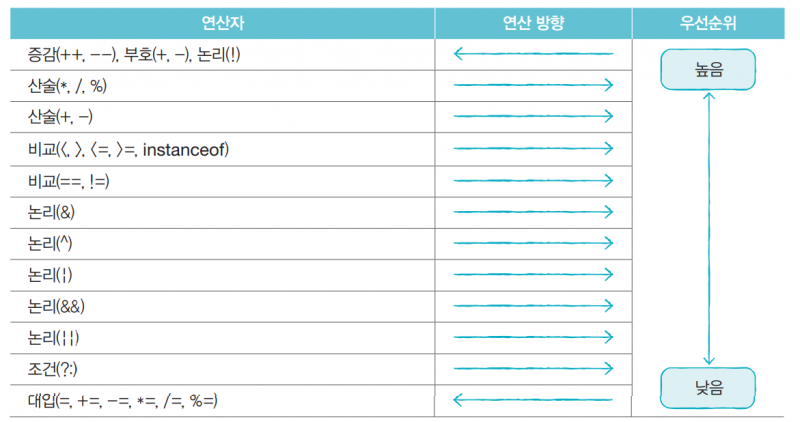

# 산술 연산자

## 연산자
연산자란?
> 연산에 사용되는 표시나 기호를 뜻합니다.


연잔자는 산출 방법에 따라 구분할 수 있습니다.

- 산술 연산자
- 대입 연산자
- 증감 연산자
- 논리 연산자
- 비교 연산자
- 조건 연산자
- 비트 연산자

등의 다양한 연산자가 있고, 피연산자의 개수에 따라 단항 연산자, 이항 연산자, 삼항 연산자로 분류할 수도 있습니다.

 
## 산술 연산자
그 중에서도 수학적인 계산에 이용되는 연산자입니다.

```java
int a = 10;
int b = 5;
```
위와 같이 정수형 변수를 설정하였습니다.
### 일반 연산

① 덧셈연산
> ` [피연산자] + [피연산자]`
> ```java
> int result = a + b; // 10 + 5
> System.out.println(result); // 15
>```

② 뺄셈연산
> ` [피연산자] - [피연산자]`
> ```java
> int result = a - b; // 10 - 5
> System.out.println(result); // 5
>```


③ 곱셈연산
> ` [피연산자] * [피연산자]`
> ```java
> int result = a * b; // 10 * 5
> System.out.println(result); // 50
>```

④ 나눗셈연산
> ` [피연산자] / [피연산자]`
> ```java
> int result = a / b; // 10 / 5
> System.out.println(result); // 2
>```

⑤ 나머지연산
> ` [피연산자] % [피연산자]`
> ```java
> int result = a % b; // 10 % 5
> System.out.println(result); // 0
>```


## 연산자 우선순위



- 단항 > 이항 > 삼항

- 산술 > 비교 > 논리 > 대입

- 곱셈 & 나눗셈 > 덧셈 & 뺄셈

- 왼쪽 > 오른쪽

> **괄호 ()**는 최우선 순위를 갖습니다.

```java
System.out.println(5 + 2 * 5); // 15
System.out.println((5 + 2) * 5); // 35
System.out.println(5 + 2 > 2 * 5) // false
```


  　

  　 
  　


참고 자료 : https://www.hanbit.co.kr/store/books/look.php?p_code=B5635758676
