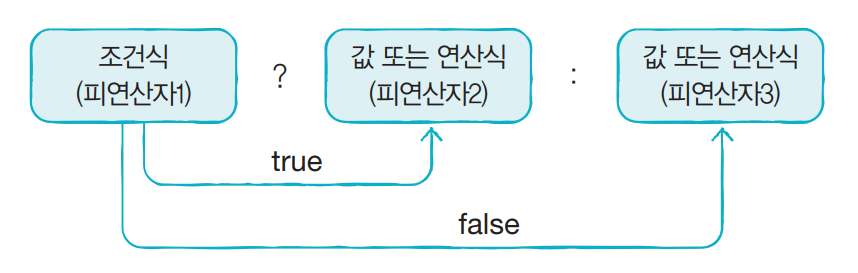

# 삼항 연산자

삼항 연산자란?
> 3개의 피연산자가 필요로하는 연산자를 뜻합니다.

조건식의 논리형에 따라 결과값이 결정되어 조건 연산자라고 불리기도 합니다.
조건식의 논리값이 true이면 `:` 좌변의 결과값이, 조건식의 논리값이 false라면 `:` 우변의 결과값이 반환됩니다.



>` [피연산자] ? [피연산자] : [피연산자]`
> 
> → (조건) ? (참일 경우 결과값) : (거짓일 경우 결과값)
>```java
> boolean bool = true;
> String result = bool ? "맞습니다." : "틀렸습니다.";
> System.out.println(result); // "맞습니다."
>
> bool = false;
> result = bool ? "맞습니다." : "틀렸습니다.";
> System.out.println(result); // "틀렸습니다."
>
> result = (5 < 3) || (11 != 11) ? "TRUE" : "FALSE";
> System.out.println(result); // "FALSE"
>```


사진 출처 : https://www.hanbit.co.kr/store/books/look.php?p_code=B5635758676